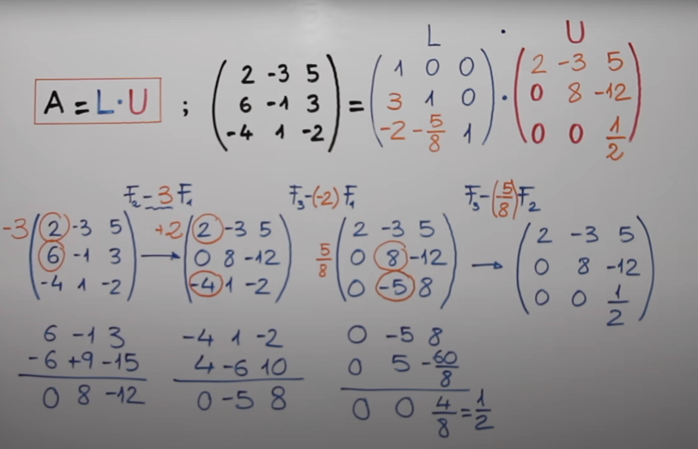
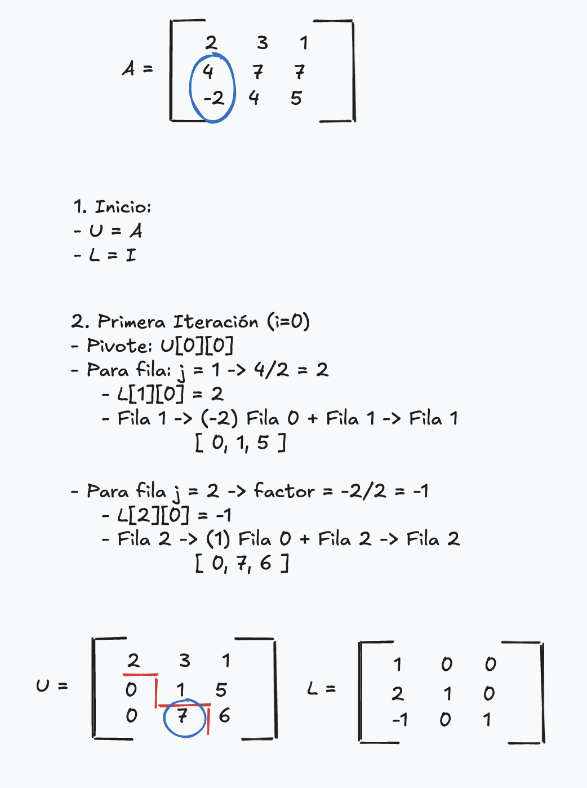
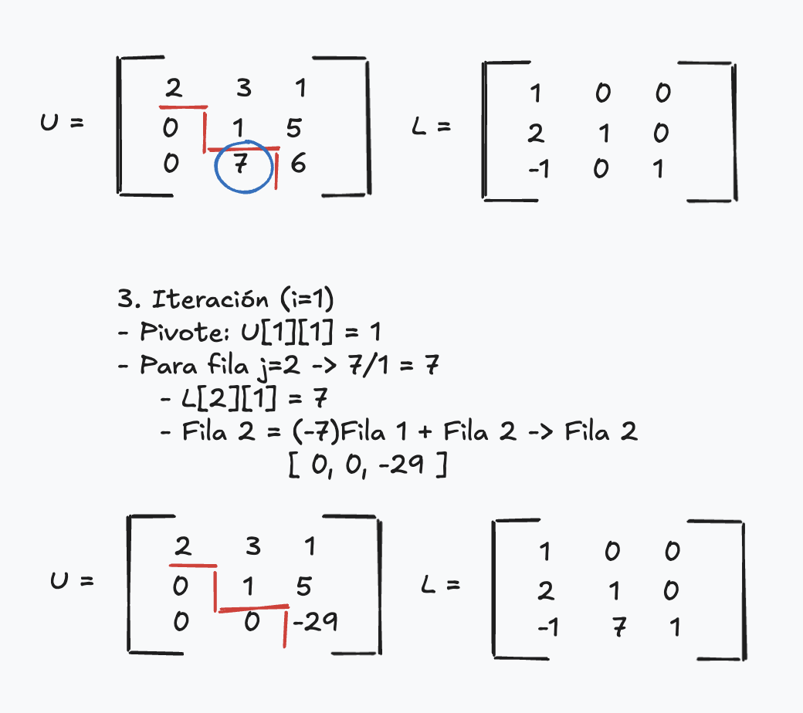
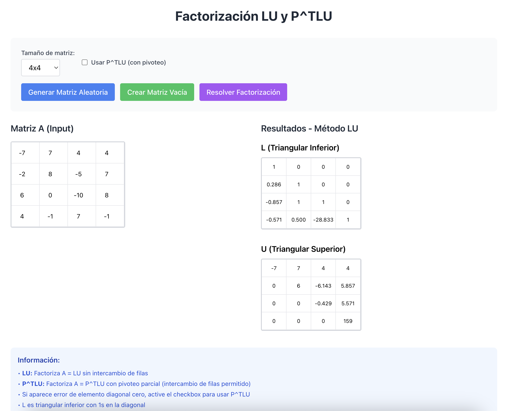

# Proyecto: Factorización LU - Algebra Lineal

## 🎯 Objetivo
Pida el ingreso de n ∈ [4; 10] y genere aleatoriamente los elementos de una matriz simétrica A de orden n. El programa debe mostrar una matriz triangular inferior L y una matriz triangular superior U (en caso existan) tal que A = LU.
En caso contrario, muestre la factorizacion P^TLU.

## 🧮 Factorización LU
Este proceso consiste en descomponer una matriz A en dos matrices L y U, donde L es una matriz triangular inferior y U es una matriz triangular superior.

## 🤓 Teoría


## Ejecución
Para correr el programa, simplemente corre los siguientes comandos
```bash
npm i
npm run dev
```

## 👨‍💻 Explicación del Código
El código madre se encuentra en `src/utils/matrixUtils.js`. Aquí va su explicación mas a detalle...

### Factorización LU
```js
for (let i = 0; i < n - 1; i++) {
```
- `i` representa la columna en la que estamos trabajando.

```js
if (Math.abs(U[i][i]) < 1e-10) {
  throw new Error(...);
}
```
- Verifica que el pivote (diagonal) no sea 0 → porque no podríamos dividir.
- Por eso existe la versión con pivoteo (PLU).

```js
for (let j = i + 1; j < n; j++) {
  const factor = U[j][i] / U[i][i];
  L[j][i] = factor;

```
- Para cada fila `j` que está debajo de la fila pivote:
    - Calculamos cuánto hay que multiplicar la fila pivote para restarla y anular la posición `(j,i)`.
    - Ese valor se guarda en `L[j][i]`.


```js
for (let k = i; k < n; k++) {
  U[j][k] -= factor * U[i][k];
}
```
- Restamos la fila pivote multiplicada por el factor para anular la posición `(j,i)`.
- Así, en `U` vamos generando ceros debajo de la diagonal.

Al final...
- `L` tiene todos los factores usados para generar ceros debajo de la diagonal.
- `U` tiene la matriz triangular superior resultante.


### Factorización P^T*LU
Casi lo mismo que LU, pero con pivoteo.

```js
for (let i = 0; i < n - 1; i++) {
```
- Recorremos las columnas

```js
let maxRow = i;
for (let k = i + 1; k < n; k++) {
  if (Math.abs(U[k][i]) > Math.abs(U[maxRow][i])) {
    maxRow = k;
  }
}
```
- Busca el elemento más grande en valor absoluto en la columna actual (a partir de la fila i).
- Esto asegura que el pivote sea el más estable numéricamente.

```js
if (maxRow !== i) {
  swapRows(U, i, maxRow);
  swapRows(P, i, maxRow);
  permutations.push({ from: i, to: maxRow });
}
```
- Si el pivote no está en la fila actual, intercambiamos filas en `U` y registramos el cambio en `P`.
- `permutations` nos ayudará a mostrar el orden de las filas intercambiadas.
- `P` es la matriz de permutación, que refleja los intercambios.

```js
if (Math.abs(U[i][i]) < 1e-10) throw ...
```
- Igualmente, se verifica que el pivote no sea 0 → porque no podríamos dividir.

```js
for (let j = i + 1; j < n; j++) {
  const factor = U[j][i] / U[i][i];
  L[j][i] = factor;
  
  for (let k = i; k < n; k++) {
    U[j][k] -= factor * U[i][k];
  }
}
```
- Calculamos el factor de eliminación.
- Lo guardamos en `L`.
- Hacemos ceros debajo del pivote en `U`.

Finalmente:
```js
const PT = ... // transpuesta de P
```
- Calculamos la transpuesta de P para obtener P^T.


### Ejemplo con Matriz 3x3





## 🙈 Demo Proyecto
 